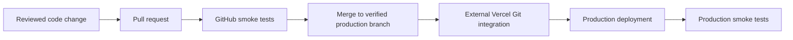

The repository supports a GitHub-to-Vercel deployment model. GitHub Actions validates changes and production deployments, but it does not create the Vercel deployment.

## Confirmed from the repository

- `vercel.json` configures response headers for selected routes.
- Source code reads Vercel runtime variables.
- GitHub Actions runs smoke tests for `main` and `master` pushes and pull requests.
- GitHub Actions reacts to a successful `Production` deployment status.
- `main` is the remote default and strongest production-branch candidate.

## Verify before the next release

The Vercel dashboard must confirm the project, team, connected repository, production branch, root directory, install command, build command, environment scopes, domains, protection, and rollback controls.

<Warning>
Do not assume a merge to `main` deploys production until an authorized Vercel administrator confirms the project's Git settings.
</Warning>
