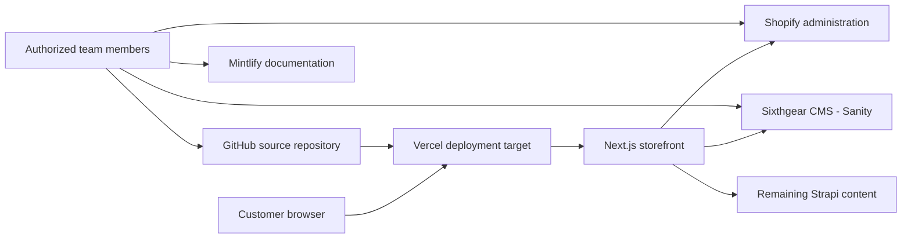

## Sixthgear Documentation

The complete operational and technical guide for managing, maintaining, and developing the Sixthgear ecommerce platform.

This private documentation gives the team one maintained source for operational procedures and technical guidance. Use it when you manage commerce data, update website content, work on the storefront, deploy a change, or investigate a problem.

## What this documentation covers

<CardGroup cols={2}>
  <Card title="Initial Setup" icon="list-start" href="/initial-setup/overview">
    Prepare the required accounts, local tools, repository access, and project configuration before you begin work.
  </Card>
  <Card title="Sixthgear CMS" icon="panels-top-left" href="/sixthgear-cms/overview">
    Understand the Sanity-based editing system and the remaining content paths that still depend on Strapi.
  </Card>
  <Card title="Shopify Administration" icon="shopping-bag" href="/shopify/overview">
    Manage products, variants, inventory, collections, customer commerce data, and connected store features.
  </Card>
  <Card title="Storefront Development" icon="code-2" href="/storefront-development/overview">
    Work with the Next.js application, its source code, integrations, tests, and local development workflow.
  </Card>
  <Card title="SEO" icon="search-check" href="/seo/overview">
    Maintain search metadata, structured content, crawl controls, redirects, and review practices.
  </Card>
  <Card title="Deployment" icon="rocket" href="/deployment/overview">
    Prepare, release, verify, and, when necessary, roll back reviewed storefront changes.
  </Card>
  <Card title="Accounts and Access" icon="key-round" href="/accounts-and-access/overview">
    Maintain approved access, ownership, recovery, and credential-handling procedures without recording secrets.
  </Card>
  <Card title="Troubleshooting" icon="wrench" href="/troubleshooting/overview">
    Diagnose website, commerce, CMS, deployment, and access issues using verified recovery paths.
  </Card>
</CardGroup>

## Sixthgear systems at a glance

The following systems are confirmed by the storefront source code or this documentation project. External account ownership, billing, production settings, domains, and DNS remain subject to administrator verification.

| System | What it does | What it controls | Required for normal operations? |
| --- | --- | --- | --- |
| Next.js storefront | Builds and serves the customer-facing ecommerce application. | Page rendering, country routes, application behavior, and connections to commerce and content services. | Yes. It is the customer-facing application. |
| Shopify | Provides the Storefront and Admin APIs and hosted checkout. An API is a defined way for systems to exchange data. | Products, variants, inventory, collections, carts, customers, orders, and checkout. | Yes. Core commerce depends on it. |
| Sixthgear CMS (Sanity) | Provides structured content and an embedded editing Studio at `/studio`. | Sanity-managed homepage, marketing, service, blog, and supporting content records. | Yes for normal content-management work. |
| Strapi | Supplies content through source modules that remain actively imported. | Remaining homepage, preview, service, navigation, rider-story, and First Gear Coffee content paths. | Yes for affected features until migration is verified complete. |
| GitHub | Stores source code and runs the repository's Playwright smoke-test workflow. | Version history, reviewed code changes, and automated repository checks. | Yes for controlled development and release work; it does not serve customer requests directly. |
| Vercel | Is the deployment target indicated by runtime variables, configuration, and production deployment-status checks. | Application hosting behavior once the external project is connected and verified. | Yes for the repository-supported hosting model; dashboard settings still require confirmation. |
| Mintlify | Builds this MDX documentation into a searchable internal site. MDX is Markdown that can include interface components. | Documentation presentation, navigation, search, and publishing configuration. | Yes for the documentation portal; no for storefront transactions. |

## How the systems work together

Customers reach the Next.js storefront through the configured hosting layer. The storefront requests commerce data from Shopify and content from Sanity, while some active features still request Strapi content. Authorized team members manage those systems and use GitHub to review changes. The exact Vercel project, production branch, domain, and account owners must still be confirmed in their external dashboards.

## Where to begin

<Steps>
  <Step title="Understand the system overview">
    Review the system table and architecture diagram so you know which platform owns each type of information.
  </Step>
  <Step title="Confirm accounts and access">
    Check [Accounts and Access](/accounts-and-access/overview) before starting work. Confirm access through the approved process without copying credentials into this portal.
  </Step>
  <Step title="Open the guide for your task">
    Use the navigation or coverage cards to find the procedure related to the change, operational task, or issue you need to handle.
  </Step>
</Steps>

## Security notice

<Warning>
This documentation is private. Do not share it, grant access, or reproduce its contents without authorization. Screenshots must hide customer data, account details, tokens, and other sensitive information before they are added.
</Warning>

<Danger>
Never store passwords, API tokens, private keys, recovery codes, environment-variable values, or other credentials in this repository. Store credentials only in the approved password manager and reference the approved vault item by name.
</Danger>

## Documentation status

<Note>
The documentation is being completed in phases. The current priority is:

1. Overview and introduction
2. Initial project setup
3. Sixthgear CMS
4. Shopify
5. Remaining technical and operational sections

Planned pages identify their intended scope and must not be treated as completed procedures.
</Note>

## Documentation maintenance

Update an instruction whenever the related process changes, and report screenshots that no longer match the current interface. A reviewer should check major operational or technical changes before publishing them. Git history records who changed the documentation and provides the context needed to review earlier versions.
