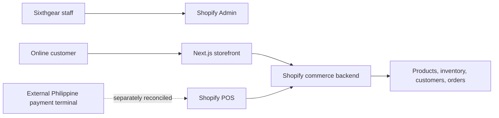

<Badge color="green" icon="badge-check">Preferred direction: Shopify POS</Badge>

## Executive summary

Sixthgear should keep Shopify as its primary commerce platform, move physical-store selling to Shopify POS, and retire Loyverse after the replacement workflow is working and required historical data has been preserved.

Removing Loyverse changes the in-store selling process. Removing Shopify would replace the ecommerce backend already used by the Next.js storefront, including products, variants, collections, inventory, customers, orders, carts, checkout, and online payments. The two choices therefore do not carry equal risk.

<Note>
Sixthgear currently uses Shopify behind the custom online storefront and owns an iMin all-in-one POS terminal. The exact iMin model and its Shopify POS and built-in-printer compatibility still require physical testing.
</Note>

## Platform relationship

A *source of truth* is the main system treated as authoritative for a type of business information. Under the recommended structure, Shopify is the source of truth for products, prices, inventory, customers, and orders across online and physical-store selling.

## Major findings

<CardGroup cols={2}>
  <Card title="Keep Shopify" icon="shopping-bag">
    The existing Next.js storefront already depends on Shopify commerce APIs and hosted checkout.
  </Card>
  <Card title="Move in-store sales" icon="store">
    Shopify POS keeps physical-store transactions in the same product, inventory, customer, and order environment.
  </Card>
  <Card title="Test the iMin" icon="monitor-smartphone">
    The existing terminal may be reusable, but application installation does not prove that its built-in printer will work.
  </Card>
  <Card title="Use modular hardware when needed" icon="tablet-smartphone">
    A supported tablet, receipt printer, secure stand, and external local payment terminal are easier to verify and replace individually.
  </Card>
</CardGroup>

## What management needs to decide

Management should approve the direction, purchase budget, local payment provider, and transition schedule. Store and technical staff should then test complete transactions, receipts, inventory movement, refunds, offline recovery, and daily reconciliation before new transactions stop in Loyverse.

## Supporting evidence

<CardGroup cols={2}>
  <Card title="Requirements and capabilities" icon="list-checks">Mandatory store requirements and the capabilities each platform can provide.</Card>
  <Card title="Comparison and consequences" icon="columns-3">Benefits, costs, risks, and the consequences of removing either platform.</Card>
  <Card title="Architecture and payments" icon="network">One-platform and two-platform data flows, external payments, and reconciliation.</Card>
  <Card title="Hardware and final direction" icon="tablet-smartphone">iMin reuse, the researched modular setup, purchases, and implementation order.</Card>
</CardGroup>

Use the **Shopify vs Loyverse** sidebar to open each supporting page.
