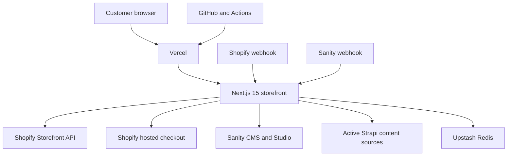

SixthGear is a headless Next.js storefront. It is not a Shopify Liquid theme and does not use Hydrogen or Oxygen.

## Request flow

1. The browser requests the Vercel-hosted Next.js application.
2. `src/app/page.tsx` redirects `/` to `/ph`.
3. `src/middleware.ts` applies country routing, maintenance behavior, and customer route guards.
4. Server components load Shopify commerce data and CMS content.
5. Customer-specific Shopify requests bypass shared fetch caching.
6. Checkout redirects the browser to Shopify's hosted `checkoutUrl`.

## Content ownership

| Data | Authoritative system | Main code path |
| --- | --- | --- |
| Products, variants, inventory, collections, cart, customers, orders | Shopify | `src/lib/shopify/`, `src/lib/data/` |
| Homepage, marketing, services, about, rider stories and structured CMS records | Sanity | `sanity/`, `src/lib/cms/` |
| Remaining homepage, preview, service, story, menu and coffee content | Strapi | `src/lib/strapi/` and active imports |
| Shared catalog cache and rate limits | Upstash Redis | `src/lib/cache/redis.ts` |
| Application runtime | Vercel | `vercel.json` and external project settings |

<Warning>
Do not remove Strapi configuration because Sanity exists. Active production-facing imports remain and must be migrated before removal.
</Warning>
